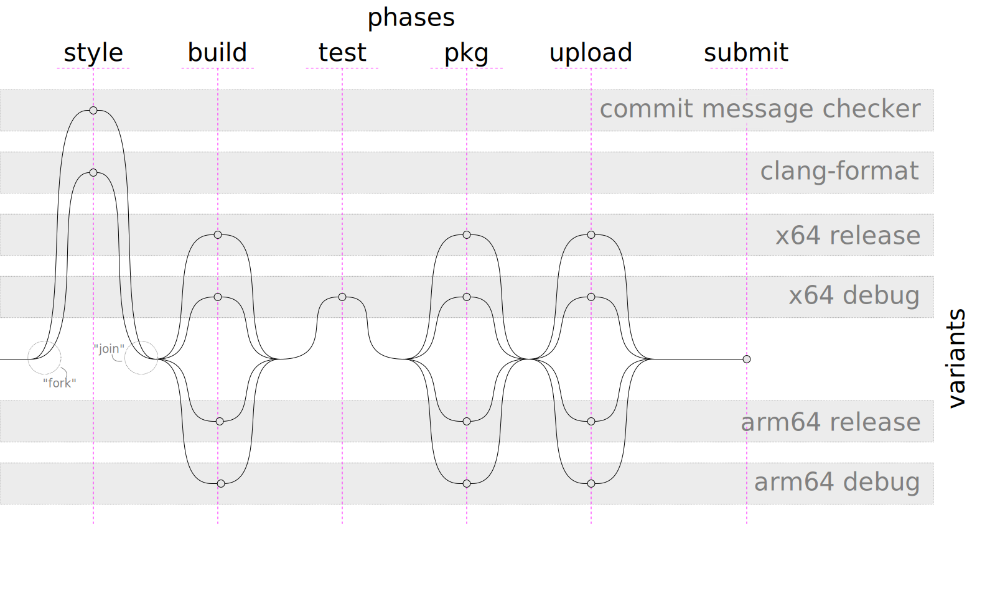

Configuration
=============

The Hopic build configuration is stored in a file in your repository.
The default location where it will look for this is ``${repo}/hopic-ci-config.yaml``.

Pre-defined Hopic variables
---------------------------

.. option:: WORKSPACE

Contains the absolute path of the git repository in which Hopic was called.

.. option:: CFGDIR

Contains the absolute path of the directory in which the `hopic-ci-config.yaml` file is located (this can differ from ``WORKSPACE`` if Hopic was called with the ``--config`` option).

.. option:: VERSION

Contains the current version of the workspace. See :option:`version` for configuration and bump settings.
The format is based on `git describe` and is formatted as:

``TAGGED_VERSION[-COMMIT_DISTANCE][.dirty.TIMESTAMP]+gCOMMIT_ID``

For example:

=========================================== ==================================================
Version                                     Meaning
=========================================== ==================================================
``1.8.1+g3269de8``                          tag **1.8.1**, clean, unmodified, ``HEAD`` is at commit **3269de8**
``1.8.1-0.dirty.20200609131656+g3269de8``   tag **1.8.1**, with uncommited changes
``1.8.1-1+gdaffe9c``                        tag **1.8.1**, with one commit on top of it (**-1**)
``1.8.1-1.dirty.20200609152429+g4dbb6b4``   tag **1.8.1**, with one commit on top of it, as well as uncommitted changes
=========================================== ==================================================

.. option:: PURE_VERSION

Contains the :option:`VERSION` (see above), but without ``build metadata`` (everything after the``+``).

For example:

=========================================== ==================================================
Version                                     Meaning
=========================================== ==================================================
``1.8.1``                                   tag **1.8.1**, clean, unmodified
``1.8.1-0.dirty.20200609131656``            tag **1.8.1**, with uncommited changes
``1.8.1-1``                                 tag **1.8.1**, with one commit on top of it
``1.8.1-1.dirty.20200609152429``            tag **1.8.1**, with one commit on top of it, as well as uncommitted changes
=========================================== ==================================================

.. option:: DEBVERSION

Contains a Debian version-compliant representation of the :option:`VERSION` as outlined above.
Its specification can be found at: https://www.debian.org/doc/debian-policy/ch-controlfields.html#version

For example:

=========================================== ==================================================
Version                                     Meaning
=========================================== ==================================================
``1.8.1+g3269de8``                          tag **1.8.1**, clean, unmodified, ``HEAD`` is at commit **3269de8**
``1.8.1~0+dirty20200609131656+g3269de8``    tag **1.8.1**, with uncommited changes
``1.8.1~1+gdaffe9c``                        tag **1.8.1**, with one commit on top of it (**~1**)
``1.8.1~1+dirty20200609152429+g4dbb6b4``    tag **1.8.1**, with one commit on top of it, as well as uncommitted changes
=========================================== ==================================================

.. option:: PUBLISH_VERSION

Based on the :option:`VERSION` (see above) by default, with the following differences:
* Where ``COMMIT_ID`` is part part of the ``prerelease`` (``-COMMIT_ID``) instead of ``build metadata`` (``+gCommit_ID``)
* Where ``build`` is present in the `Versioning`_ configuration this is added, e.g. ``+build`` (only to ``PUBLISH_VERSION``)

During a build that is publishing, this is based on :option:`PURE_VERSION`.
Currently the version ``build`` property only affects ``PUBLISH_VERSION``.
The ``build`` property value is appended to the build metadata.

Some package managers (e.g Maven) do not correctly implement SemVer 2.0.0. 
Those package managers fail to perform range checks with a 'build metadata' component, because they treat the build metadata as an alphanumeric part of the version instead of ignoring it.

Pre-defined environment variables
---------------------------------

The **VERSION**, **PURE_VERSION**, **DEBVERSION** and **PUBLISH_VERSION** variables (documented above) are also available in the environment of any process spawned by Hopic.

Build Phases
------------

.. option:: phases

Hopic's build flow is divided in ``phases``, during which a set of commands can be executed for different ``variants``.
The :option:`phases` option is a dictionary of dictionaries.
It's top-level key specifies the name of each phase.
The keys within each phase specify the names of variants to be executed within that phase.
Note that the variant name ``post-submit`` is reserved for internal use and is not permitted to be specified by users.

Phases are executed in the order in which they appear in the configuration.
Within a phase each variant may be executed in parallel, possibly on different executors.
Every next phase only starts executing when each variant within the previous phase finished successfully.
I.e. the execution flow "forks" to each variant at the start of a phase and "joins" at the end.

A variant, identified by its name, may appear in multiple phases.
Variants appearing in multiple phases are guaranteed to run on the same executor within each phase.
This provides a stable environment (workspace) to work in and allows incremental steps, such as building in phase A and running built tests in phase B.

For example, the configuration example listed results in an execution flow as shown after that.

.. literalinclude:: ../../examples/parallel-phases.yaml
   :language: yaml

    Example execution flow of a Hopic build configuration.

Post Submission Phases
----------------------

.. option:: post-submit

Optionally, as part of the submission, Hopic provides the opportunity to execute another list of phases.
These will be executed during the ``submit`` subcommand, but just after the actual submission to the revision control system has been performed.
The :option:`post-submit` option is a dictionary of phases.
The keys specify the name of each phase.

The content of each phase has the same syntax, and is interpreted the same, as the content of a variant for :option:`phases`.
Only the following subset of options however, is permitted to be used within these phases:

* :option:`description`
* :option:`docker-in-docker`
* :option:`image`
* :option:`node-label`
* :option:`run-on-change`
* :option:`sh`
* :option:`volumes`
* :option:`with-credentials`

The :option:`node-label` option has an additional restriction.
If specified multiple times, it is only allowed to contain the same value for each location it is specified.
This is necessary to keep the complexity, and thus chance of failure, of the ``submit`` command low.

.. literalinclude:: ../../examples/post-submit.yaml
   :language: yaml

Environment
-----------

.. option:: environment

Sometimes it's necessary to execute a command with altered environment variables.
For that purpose it's possible to use leading ``name=value`` words in the :option:`sh` command.
This requires shell escaping and because of that may not always be convenient enough to use.
To address this command entries may instead use the ``environment`` option.
Note that using the ``environment`` option disables processing of leading ``name=value`` words.

This option specifies a mapping of environment variables and the values to override them with for the current command only.
The ``null`` value can be used to require removal of the specified environment variable.
This is different from specifying the empty string which will still allow the environment variable to exist (but be empty).

.. literalinclude:: ../../examples/environment.yaml
   :language: yaml

CI-locks
--------

.. option:: ci-locks

When within a Hopic file multiple git repo's are changed and submitted it might be required to have a lock on every git repo.
The current repo where Hopic is used is automatically protected with a lock.
The :option: `ci-locks` option can be used to specify additional repositories whose locks should be acquired during the merge submit flow.
This assumes that the other git repo's are protected with a named lock while merging a change. 

:option:`ci-locks` requires a list of of ``branch`` and ``repo-name``:

``branch``
    Target git branch name that needs to be protected

``repo-name``
    Target git repo-name that needs to be protected

The named lock that Hopic will acquire is formatted as ``repo-name``/``branch``
If all merge checks pass and Hopic is going to submit the merge, all specified addition locks will be acquired at the beginning of a build, alongside the repository's own lock.

.. literalinclude:: ../../examples/ci-locks.yaml
   :language: yaml

Clean
-----

.. option:: clean

Hopic provides built-in clean check-out functionality by executing ``git clean -fxd`` on the ``${WORKSPACE}``.
It is possible to add a list of commands that is executed before the ``git clean -fxd`` is executed.
Within the list of commands ``$HOME`` and ``~`` will be expanded to the home directory of the current user. 

.. literalinclude:: ../../examples/clean.yaml
   :language: yaml

Config
------

.. option:: config

Some features in Hopic are using YAML's `explicit tags`_ functionality to support custom defined YAML parsing behavior.
Features that use this functionality can be recognized by ``<dict_key>: !<custom_function>``.
Since explicit tags need to be specified as a value of a dictonary, the ``config`` is introduced to specify explicit tags on the top level.
``config`` transparently adds a top level dictionary which allows making a global explicit tag.

.. literalinclude:: ../../examples/config.yaml
   :language: yaml

.. _explicit tags: https://yaml.org/spec/1.1/#id858600

Credentials
-----------

.. option:: with-credentials

Sometimes it's necessary to execute commands with privileged access.
For that purpose the :option:`with-credentials` configuration option can be used for a variant within a phase.
You need to specify an identifier (``id``), used for looking up the credential and its type (``type``).
In addition to that you can specify the name of the config and environment variable that should be set to contain them.
:option:`with-credentials` value can be specified as a list to have multiple credentials for a variant within a phase.
Username/password credentials can be optionally encoded for use in a url by configuring encoding to (``url``).

The supported types of credential are:

Username/password credential
++++++++++++++++++++++++++++

   * ``type``: ``username-password``
   * ``username-variable`` default: ``USERNAME``
   * ``password-variable`` default: ``PASSWORD``
   * ``encoding``: default: ``plain``

File credential
+++++++++++++++

   * ``type``: ``file``
   * ``filename-variable`` default: ``SECRET_FILE``

String credential
+++++++++++++++++

   * ``type``: ``string``
   * ``string-variable`` default: ``SECRET``

SSH key credential
++++++++++++++++++

   * ``type``: ``ssh-key``
   * ``ssh-command-variable`` default: ``SSH``

This provides, in the variable specified by ``ssh-command-variable``, an executable that will behave like ``ssh``.
It will however be pre-authenticated with the credential's SSH key and, if known, associated user.

.. literalinclude:: ../../examples/with-credentials.yaml
   :language: yaml

Keyring Support
+++++++++++++++

For local, interactive, use Hopic also supports credentials stored in your keyring using the `keyring`_ library.
Note that ``keyring`` is only an optional dependency of Hopic and will only get installed when the ``interactive`` extra feature is selected.

If you didn't install Hopic with the ``interactive`` feature you can either reinstall it or install the ``keyring`` library yourself.
Note on macOS you will also need to install the ``netstruct`` library.

.. code-block:: console

   pip3 install keyring

This has been tested and confirmed to work with at least these keyring implementations:

* gnome-keyring-daemon: GNOME's builtin keyring
* KeepassXC 2.6

.. option:: project-name

If properly configured, Hopic will attempt to obtain all ``username-password`` credentials used during execution from your keyring.
In order to do that, Hopic needs to know a project scope within which to look for your credentials.
This scope can be configured with the ``project-name`` option.
We suggest using your projects Jira keyword for this purpose as it's the most likely to be unique enough.

.. literalinclude:: ../../examples/with-keyring-credentials.yaml
   :language: yaml

This example will cause Hopic to look for a credential with a value for the ``service`` field of ``JIRA_KEY-artifactory-creds``.
When found, it will use its ``username`` and ``password`` fields for the ``publish`` command.

When Hopic doesn't find the credential in the keyring, its behavior depends on whether it's running in an interactive terminal or not.

When Hopic runs in an interactive terminal, it will prompt the user for the username and password.
It will store these in your keyring and continue execution with those values.

When Hopic doesn't run in an interactive terminal, like on your CI system, it will attempt to obtain the credentials from your CI system's credential store.
The :option:`project-name` will not be taken into account when looking in the CI system's credential store.
That option applies to keyring lookups only.
If it cannot find them there, it will fail with an error message indicating it couldn't find the specific credential.

.. _keyring: https://pypi.org/project/keyring/

Container Image
---------------

.. option:: image

In order to execute commands within a Docker container Hopic needs to be told what image to use for creating a container.
This option can either contain a string in which case every variant will execute in a container constructed from that image.
Alternatively it can contain a mapping where the keys and values are the names of the variant and the image to execute those in respectively.
If using the mapping form, the ``default`` key will be used for variants that don't have an image specified explicitly.
The image can also be specified within a phase for a variant, this will override the global specified image for the specific variant for only the phase where it is specified.

An example of the mapping style where two different variants are executed in containers based on different images:

.. literalinclude:: ../../examples/image-mapping.yaml
    :language: yaml

For the purpose of using an image (name and version) specified in an Ivy dependency manifest file the `!image-from-ivy-manifest` type constructor exists.
When used its contents are a mapping with these keys:

``manifest``
    Path to the Ivy manifest file.
    Relative paths are interpreted relative to the first of the ${CFGDIR} or ${WORKSPACE} directories that exists.
    This defaults to the first of these to exist:

    * ``${WORKSPACE}/dependency_manifest.xml``
    * ``${CFGDIR}/dependency_manifest.xml``

``repository``
    Docker repository to fetch the image from.

``path``
    Directory within the repository to fetch from.

``name``
    Name of the image to fetch.
    This defaults to the content of the ``name`` attribute in the Ivy manifest.

``rev``
    Version of the image to fetch.
    This defaults to the content of the ``rev`` attribute in the ivy manifest.

When used this will get treated as if the expansion of ``{repository}/{path}/{name}:{rev}`` was specified as a string value of this field.
This allows using Ivy as a mechanism for automatically keeping the Docker image up to date.

For example, when using this dependency manifest in ``${WORKSPACE}/dependency_manifest.xml``:

.. code-block:: xml

   <ivy-module version="2.0">
     <info module="p1cms" organisation="com.tomtom" revision="dont-care" />
     <dependencies>
       <dependency name="python" org="com.tomtom.toolchains" rev="3.6.5" revConstraint="[3.5,4.0[">
         <!-- identify this as the dependency specifying the Docker image for Hopic -->
         <conf mapped="toolchain" name="default" />
       </dependency>
     </dependencies>
   </ivy-module>

And this Hopic config file:

.. literalinclude:: ../../examples/image-ivy-manifest.yaml
    :language: yaml

The result will be to use the ``hub.docker.com/tomtom/python:3.6.5`` image by default.
The ``PyPy`` build will instead use the ``hub.docker.com/tomtom/pypy:3.6.5`` image.
I.e. for that build the image name is overridden from that used in the Ivy manifest, while still using the version from it.

Extra Docker arguments
----------------------

.. option:: extra-docker-args

There is a limited subset of ``docker run`` arguments that can be specified for a variant:

``add-host``
    This options accepts one value or a list of values.
    Translates into ``docker run`` argument ``--add-host=<value>``, allowing the user to add a custom DNS entry to the container.
    If a list is provided, the option shall be expanded to multiple ``--add-host`` arguments, e.g. ``--add-host=<list-item-1> --add-host=<list-item-2>``.

``device``
    This options accepts one value or a list of values.
    Translates into ``docker run`` argument ``--device=<value>``, allowing the user to forward a device from the host machine to the container.
    If a list is provided, the option shall be expanded to multiple ``--device`` arguments.

``dns``
    Translates into ``docker run`` argument ``--dns=<value>``, allowing the user to specify custom DNS servers to be used in the container.

``entrypoint``
    Translates into ``docker run`` argument ``--entrypoint=<value>``, allowing the user to override the entrypoint as defined in the Docker image.

``hostname``
    Translates into ``docker run`` argument ``--hostname=<value>``, allowing the user to specify the hostname that the container shall use.

``init``
    This option only accepts boolean value ``True``.
    When provided, this translates into ``docker run`` argument ``--init``, which adds an init daemon to the container.

.. literalinclude:: ../../examples/docker-extra-args.yaml
    :language: yaml

Docker in Docker
----------------

.. option:: docker-in-docker

Sometimes it may be necessary to perform operations on the Docker daemon from within a Docker container.
E.g. trying to use some tool that resides in a different Docker container from within a build running in a container.
If that happens this option can be used to make the required Docker socket available within the first container.

.. literalinclude:: ../../examples/docker-in-docker.yaml
    :language: yaml

Volumes
-------

.. option:: volumes

In order to execute commands within Docker it is often required to mount directories or a file to the docker container.
This can be done by specifying :option:`volumes`. 
:option:`volumes` doesn't have any effect when there is no :option:`image` specified.

There are two formats how a volume can be specified:

**Format 1**

The volume can be specified as ``host-src``\[:``container-dest``][:``<options>``].
The ``options`` are [rw|ro]
The ``host-src`` is an absolute path or a name value.

**Format 2**

The volume can be specified using a dictionary with the following keys:
    - ``source``
    - [``target``]
    - [``read-only``]

Where ``source`` is equal to ``host-src``, ``target`` is equal to ``container-dest`` and ``read-only`` reflects the possible ``options`` with a boolean value.

By default the ``host-src`` is mounted rw.

When the given ``host-src`` doesn't exist Hopic will create the path as a directory to prevent dockerd from creating the directory as root user.
If ``container-dest`` is not specified, it will take the same value as ``host-src``.
For the ``host-src`` path, ``$HOME`` or ``~`` will be expanded to the home directory of the current user.
While for the ``container-dest``, ``$HOME`` or ``~`` will be expanded to ``/home/sandbox``.

The following directories and files are mounted by default:

==================== =============== ===============
host-src             container-dest  <options>
==================== =============== ===============
/etc/passwd [#vdf1]_ /etc/passwd     read-only
/etc/group [#vdf1]_  /etc/group      read-only
``WORKSPACE`` [*]_   /code           read-write
==================== =============== ===============

.. [#vdf1] From version 2.0.0 onwards this will no longer be mounted by default, so specify it explicitly if you rely on it.
.. [*] ``WORKSPACE/code`` for repositories referring to other repositories for their code.

These defaults can be disabled by specifying a `null` source for them:

.. literalinclude:: ../../examples/disable-etc-volumes.yaml
   :language: yaml

:option:`volumes` can be declared in every scope and will be used during the specified scopes
e.g. :option:`volumes` specified in global scope are used with every command. 
In case an inherited bind mount needs to be overridden, that can be accomplished by adding a volume with the same ``target_location``.
Consider the following example where `/tmp/downloads` is overridden:

**example:**

.. literalinclude:: ../../examples/volumes-override.yaml
   :language: yaml

Environment Variables
---------------------

.. option:: pass-through-environment-vars

This option allows passing environment variables of the host environment through into containers.
This is a list of strings.
Each string is the name of an environment variable.
If the named environment variable exists in the host environment, it will be set to the same value inside the container.

.. literalinclude:: ../../examples/pass-through-env-vars.yaml
   :language: yaml

Mounting Volumes From Other Containers
--------------------------------------

.. option:: volumes-from

The option ``volumes-from`` allows you to mount volumes that are defined in an external *Docker image*.
The behavior translates directly to a ``--volumes-from`` Docker-run option; the volumes are mapped to the path as originally specified in the external image.

Note that this option does nothing if you haven't specified a Docker image (see the :option:`image` option).

The option requires two keys to be specified:

``image-name``
    The full name of the Docker image.

``image-version``
    The targeted version of the Docker image.

The combination of ``<image-name>:<image-version>`` should result in a correct, downloadable Docker image.

**example:**

.. literalinclude:: ../../examples/with-volumes.yaml
    :language: yaml

Publish From Branch
-------------------

.. option:: publish-from-branch

The ``publish-from-branch`` option, when provided, specifies a regular expression matching the names of branches from which to allow publication.
Publication includes version bumping (see :option:`version`) and the execution of any steps marked with :option:`run-on-change` as ``only``.

If this option is omitted, Hopic allows publication from any branch.

The example below configures Hopic to only publish from the ``master`` branch or any branch starting with ``release/`` or ``rel-``.

**example:**

.. code-block:: yaml

  publish-from-branch: '^master$|^release/.*|^rel-.*'

Versioning
----------

.. option:: version

Hopic provides some support for determining and bumping of the currently checked out version.

It currently supports the syntax, sorting and bumping strategies of these versioning policies.
The policy to use can be specified in the ``format`` option of the ``version`` option section.

``semver``
   `Semantic Versioning`_. This is the default when no policy is explicitly specified.

   The default tag format is ``{version.major}.{version.minor}.{version.patch}``.

   The default component to bump is the pre-release label.

``carver``
   Caruso variation on Semantic Version for branching

   The default tag format is ``{version.major}{version.minor}{version.patch}+PI{version.increment}.{version.fix}``.

   The default component to bump is the pre-release label.

The version can be read from and stored in two locations:

``version.file``
    When this option is specified Hopic will always use this as the primary source for reading and storing the version.
    The first line to contain only a syntactically valid version, optionally prefixed with ``version=``, is assumed to be the version.
    When reading the version it'll use this verbatim.
    When storing a (likely bumped) version it'll only modify the version portion of that file.

``version.tag``
    When this option is set to ``true`` or a non-empty string Hopic will, when storing, create a tag every time it creates a new version.
    When this option is set to a string it will be interpreted according to `Python Format Specification`_ with the named variable ``version`` containing the version.
    When this option is set and ``file`` is not set it will use `git describe <https://git-scm.com/docs/git-describe>`_ to read the current version from tags.
    When used for reading, it will mark commits that don't have a tag a virtual prerelease of the predicted next version.

    Setting this option to a string can, for example, be used to add a prefix like ``v`` to tags, e.g. by using ``v{version}``.
    Having it set to ``true`` instead uses the version policy's default formatting.

``version.build``
    When using ``semver`` it is possible to define custom `build metadata`_ (see https://semver.org/#spec-item-10), by setting the ``build`` property.
    When this option is set, the ``build`` value will be appended to the tag according to the semver build metadata spec (``+<version.build>``).
    Currently, this setting will only affect the PUBLISH_VERSION as described in the `Pre-defined Hopic variables`_ chapter.

When and what to bump can be controlled by the ``version.bump`` option.
When set to ``false`` it disables automated bumping completely.
Otherwise it describes a version bumping policy in its ``version.bump.policy`` member.

There are currently two version bumping policies available:

``constant``
    Its ``version.bump.field`` property specifies what field to bump.
    It will always bump that field and no other.
    When not specified it defaults to bumping the default-to-bump part of the used version policy.

   .. literalinclude:: ../../examples/version-bump-constant.yaml
       :language: yaml

``conventional-commits``
   When used this policy determines the version field to bump based on commit messages formatted according to `Conventional Commits`_.
   It searches all to-merge commits for breaking changes, new features and fixes.
   If any of those are present it will bump, in order of precedence, the major, minor or patch number.

   The ``version.bump.strict`` option of this policy controls whether each commit message is required to parse as a valid Conventional Commit.
   If set to ``false`` invalidly formatted messages are just ignored and not taken into account to determine what to bump.
   Otherwise the merge will fail when encountering invalidly formatted messages.
   Additionally, if ``version.bump.strict`` is set to ``true``, the merge-change-request ``title`` version bump is validated against the corresponding commit messages version bump and the merge will fail if the version bump mismatches.

   The ``version.bump.reject-breaking-changes-on`` and ``version.bump.reject-new-features-on`` options specify regular expressions matching branch names.
   Merges into these branches will be rejected if, respectively, they contain breaking changes or new features.
   The purpose of this is to prevent accidental inclusion of these kinds of changes into release branches.

   .. literalinclude:: ../../examples/version-bump-conventional.yaml
       :language: yaml

In order to configure a version bumping policy without automatically bumping for every change the ``version.bump.on-every-change`` option can be set to ``false`` (defaults to ``true``).

When bumping is enabled, Hopic bumps each time that it applies a change.
Usually this means when it's merging a pull request.
Another option is when it's performing a modality change (currently only ``UPDATE_DEPENDENCY_MANIFEST``).

.. todo:: Describe ``after-submit``. Maybe?

.. _Semantic Versioning: https://semver.org/
.. _Python Format Specification: https://docs.python.org/3/library/string.html#formatspec
.. _Build Metadata: https://semver.org/#spec-item-10
.. _Conventional Commits: https://www.conventionalcommits.org/en/v1.0.0/

Modality Changes
----------------

.. option:: modality-source-preparation

The ``modality-source-preparation`` option allows for influencing the build according to the ``MODALITY`` parameter.
If Hopic is called with a ``MODALITY`` that is present in the configuration file, then the commands as specified in that section are executed before the other phases.

See the description of the ``apply-modality-change`` parameter on the `Usage` page for the calling syntax.

Note that this is, above all, a remnant of the previous generation pipeline; it is currently only used to perform ``UPDATE_DEPENDENCY_MANIFEST`` builds.

.. note:: Defining new functionality using this option is discouraged.

``description``
    An optional description for the command, which will be printed in the logs.

``sh``
    The actual command to be run. Variables will be expanded, similar to commands defined in the :option:`phases`.

``changed-files``
    Specifies the files that are changed by the command, which are to be added to the commit.

    If omitted, Hopic forces a clean repository before running the command specified by ``sh``.
    Upon completion of the command, all files that are changed, removed and/or previously untracked are added to the commit.

``commit-message``
    The message that will be used to commit the changes when this modality is run.

    If omitted, the value of the ``MODALITY`` parameter is used as the commit message.

**example:**

.. code-block:: yaml

  modality-source-preparation:
    UPDATE_DEPENDENCY_MANIFEST:
      - sh: update_dependency_manifest.py ${CFGDIR}/dependency_manifest.xml ${CFGDIR}/ivysettings.xml
        changed-files:
          - ${CFGDIR}/dependency_manifest.xml
        commit-message: Update of dependency manifest

Extension Installation
----------------------

.. option:: pip

Hopic can be extended with extra Python packages.
For this purpose it provides the ability to install packages, with pip, before building.

The ``pip`` option contains a list of requirement strings or package installation specifications.
Each of those specifications may contain these options:

``packages``
   This option is mandatory.

   It contains a list of pip requirement strings.
   E.g. ``click>=7,<8`` or ``python-keyring``.

``from-index``
   This must be a single URL string.

   When specified this causes pip to install from this package index instead of the default one.

``with-extra-index``
   This must be a single URL string or a list of URL strings.

   When specified this causes pip to look in this index when the primary one doesn't contain the specified packages.

.. literalinclude:: ../../examples/pip.yaml
    :language: yaml

Restricting Variants to Specific Build Nodes
--------------------------------------------

.. option:: node-label

The option ``node-label`` executes the specified steps on an agent available in the Jenkins environment with the provided label(s).

**example:**

.. literalinclude:: ../../examples/node-label.yaml
    :language: yaml

Restricting Steps to Changes or Not
-----------------------------------

.. option:: run-on-change

.. autoclass:: hopic.config_reader.RunOnChange
   :members:

**example:**

.. literalinclude:: ../../examples/run-on-change.yaml
    :language: yaml

Sharing Output Data Between Variants
------------------------------------

.. option:: stash

The option ``stash`` will save files to be used in another Hopic phase.
The stashed files are available for every executor/node in every phase and workspace after the current one.

.. note:: This option is not allowed to be used within a :option:`post-submit` phase.

Use the option ``includes`` to identify the files to be stashed.
Use Wildcards like `module/dist/**/*.zip`.
A `*` expands only to a single directory entry, where `**` expands to multiple directory levels deep.

Use the option ``dir`` to change the working directory that is being used while stashing.

**example:**

.. literalinclude:: ../../examples/stash.yaml
    :language: yaml

Customizing Step Description
----------------------------

.. option:: description

The option ``description`` adds a description to the step which will be printed in the logs.

**example:**

.. literalinclude:: ../../examples/description.yaml
    :language: yaml

Branches in Subdirectory Worktrees
----------------------------------

.. option:: worktrees

.. note:: This option is not allowed to be used within a :option:`post-submit` phase.

.. todo::

    Document :option:`worktrees` option.

Repeating Steps for Commits
---------------------------

.. option:: foreach

.. todo::

    Document :option:`foreach` option.

Change Request Commits
^^^^^^^^^^^^^^^^^^^^^^

``SOURCE_COMMIT``

Change Request Autosquashed Commits
^^^^^^^^^^^^^^^^^^^^^^^^^^^^^^^^^^^

``AUTOSQUASHED_COMMIT``

Sub SCM
-------

.. option:: scm

.. todo::

    Document :option:`scm` option.

JUnit Test Results
------------------

.. option:: junit

The option ``junit`` triggers Jenkins Unit Testing.
For more information about this feature see: https://www.tutorialspoint.com/jenkins/jenkins_unit_testing.htm

**example:**

.. literalinclude:: ../../examples/junit.yaml
    :language: yaml

Artifact Archiving
------------------

.. option:: archive

The option ``archive`` allows you to archive build artifacts.
The artifacts can be stored on Jenkins and/or archived to Artifactory.

.. note:: This option is not allowed to be used within a :option:`post-submit` phase.

The base directory is the workspace.
Artifacts specified are discovered relative to the workspace.

Use Wildcards like `module/dist/**/*.zip`.
A `*` expands only to a single directory entry, where `**` expands to multiple directory levels deep.

Use the ``pattern`` option to identify and upload a specific artifact.
The specific artifact can then be uploaded to artifactory with the option ``target``.

**example:**

.. literalinclude:: ../../examples/archive.yaml
    :language: yaml

Archiving To Artifactory
^^^^^^^^^^^^^^^^^^^^^^^^

.. option:: upload-artifactory

The option ``upload-artifactory`` allows you to archive build artifacts to Artifactory.
The option ``id`` is the named identifier referring to a preconfigured Artifactory server from Jenkins' global configuration.
The artifacts to be uploaded are specified with the ``artifacts`` option.

**example:**

.. literalinclude:: ../../examples/upload-artifactory.yaml
    :language: yaml

Promoting Builds in Artifactory
"""""""""""""""""""""""""""""""

.. option:: artifactory

The option ``artifactory`` lets the user create promotion definitions for specific Artifactory repositories.
The option ``promotion`` is used to promote build artifacts. After this option the Artifactory server ID is specified.
The option ``target-repo`` specifies the Artifactory target repository.

Only build artifacts that were uploaded with the option ``upload-artifactory`` will be promoted.

**example:**

.. literalinclude:: ../../examples/artifactory-promote.yaml
    :language: yaml

Artifact Fingerprint
--------------------

.. option:: fingerprint

The option ``fingerprint`` triggers fingerprinting of build artifacts on Jenkins.
Use the option ``artifacts`` to identify the artifacts to be fingerprinted.

.. note:: This option is not allowed to be used within a :option:`post-submit` phase.

With the ``fingerprint`` option, the Jenkins "fingerprint" feature is invoked.
For more information about this feature see: https://jenkins.io/doc/pipeline/steps/core/#fingerprint-record-fingerprints-of-files-to-track-usage

**example:**

.. literalinclude:: ../../examples/fingerprint.yaml
    :language: yaml

Artifact upload-on-fail
-----------------------

.. option:: upload-on-failure

The option ``upload-on-failure`` allows artifacts to be uploaded regardless of the build status.
By default option is disabled (set to ``false``), which means that artifacts are not published when build is not marked as success.
Set this value to ``true`` to enable this option.

**example:**

.. literalinclude:: ../../examples/upload-on-fail.yaml
    :language: yaml

Artifact allow-empty-archive
-----------------------

.. option:: allow-empty-archive

Normally, a build fails if archiving returns zero artifacts. This option allows the archiving process to return
nothing without failing the build. Instead, the archive step will simply throw a warning.
Set this value to ``true`` to enable this option.

**example:**

.. literalinclude:: ../../examples/allow-empty-archive.yaml
    :language: yaml

Embed scripts
-------------

.. option:: !embed

The option ``!embed`` allows Hopic to embed a part of the configuration file from an external source.
This can be via a command line script (sed, cat, etc), or by evaluating a script.
The ``!embed`` option requires to have a ``cmd`` argument which is the command to execute.
The command should output the part of the configuration file to standard output.

The location of a script should be specified either from the workspace directory or the configuration file directory.

**example:**

.. literalinclude:: ../../examples/embed/embed.yaml
    :language: yaml

With yaml-generation.py:

.. literalinclude:: ../../examples/embed/yaml-generation.py
    :language: python
